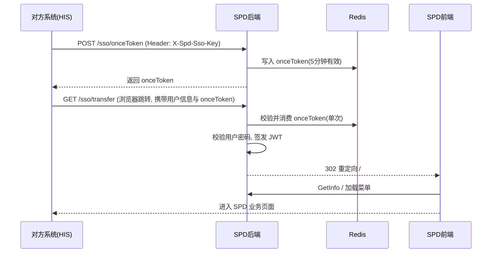

# SPD 单点登录（SSO）对接说明

> **版本**：对齐众阳 HIS 接口文档 **2.41.2**，并增加 `tenantId` 区分租户与用户。  
> **后端模块**：`spd-admin` → `SysSsoController`（`/sso/**`）  
> **前端回调**：`spd-ui` → `/#/sso-callback`（`src/views/sso-callback.vue`）  
> **配置存储**：`sys_config` 表（键名以 `sso.` 开头）

---

## 1. 概述

SPD 支持与第三方系统（如众阳 HIS）进行单点登录对接。对方系统在完成身份校验后，引导用户浏览器访问 SPD 后端 SSO 接口，SPD 验证通过后签发 JWT，并重定向至 SPD 前端完成静默登录。

### 1.1 对接流程（推荐）



### 1.2 两种登录方式

| 方式 | 接口 | 适用场景 |
|------|------|----------|
| **浏览器重定向** | `GET /sso/transfer` | HIS 菜单点击跳转 SPD（最常用） |
| **JSON 接口** | `POST /sso/login` | 对方服务端联调、或自行处理 token 后跳转前端 |

---

## 2. 接口说明

> 以下 `{后端基址}` 为 SPD 后端实际访问地址，如 `http://192.168.1.100:8080`。  
> 若经 Nginx 反向代理，路径可能带前缀（如 `/prod-api`），以现场部署为准。

### 2.1 申请一次性令牌

对方**服务端**调用，用于防重放。

```
POST {后端基址}/sso/onceToken
Content-Type: application/json
X-Spd-Sso-Key: {sso.api.key 配置值}
```

**请求体**

```json
{
  "tenantId": "zaoqiang-tcm-001"
}
```

| 字段 | 必填 | 说明 |
|------|------|------|
| `tenantId` | 是 | 租户 ID，对应 `sb_customer.customer_id` |

**成功响应示例**

```json
{
  "code": 200,
  "msg": "操作成功",
  "onceToken": "a1b2c3d4-e5f6-7890-abcd-ef1234567890",
  "tenantId": "zaoqiang-tcm-001"
}
```

**说明**

- `onceToken` 默认有效期 **5 分钟**（`sso.onceToken.expireMinutes`）
- **单次有效**：在 `/sso/transfer` 或 `/sso/login` 中使用后即失效
- `onceToken` 与申请时的 `tenantId` 绑定，不可跨租户使用

---

### 2.2 浏览器单点登录（重定向）

对方引导用户浏览器访问以下地址（GET）：

```
{后端基址}/sso/transfer?tenantId={租户ID}&onceToken={一次性令牌}&url={跳转路径}&userName={用户名}&password={密码}&deptId={科室ID}&roleId={角色ID}&systemCode={系统编码}
```

**Query 参数**

| 参数 | 必填 | 说明 |
|------|------|------|
| `tenantId` | 是 | 租户 ID |
| `onceToken` | 是 | 2.1 接口返回的一次性令牌 |
| `url` | 是 | 登录成功后跳转的**前端相对路径**，如 `/` 或 `/index`；特殊字符需 URL 编码 |
| `userName` | 是 | SPD 用户登录名（`sys_user.user_name`） |
| `password` | 是 | 用户密码；支持 RSA 加密 Base64 或明文（见 4.3） |
| `deptId` | 是 | 科室 ID；无则传空字符串 |
| `roleId` | 是 | 角色 ID；无则传空字符串 |
| `systemCode` | 是 | 对方系统编码，须在 `sso.systemCode` 允许列表中（默认 `spd`、`hc`） |

**成功行为**

HTTP **302** 重定向至：

```
{sso.frontend.baseUrl}/#/sso-callback?token={JWT}&redirect={url的URLEncode值}
```

前端 `sso-callback` 页面会：

1. 将 `token` 写入本地存储
2. 调用 `GetInfo` 获取用户信息与权限
3. 加载动态路由后跳转至 `redirect` 指定页面（默认 `/`）

**失败行为**

返回 JSON 错误（`ServiceException`），浏览器显示错误信息，不会进入 SPD 前端。

---

### 2.3 JSON 单点登录

供对方服务端或联调工具使用。

```
POST {后端基址}/sso/login
Content-Type: application/json
```

**请求体**（字段与 2.2 一致）

```json
{
  "tenantId": "zaoqiang-tcm-001",
  "onceToken": "a1b2c3d4-e5f6-7890-abcd-ef1234567890",
  "url": "/",
  "userName": "admin",
  "password": "your-password",
  "deptId": "",
  "roleId": "",
  "systemCode": "hc"
}
```

**成功响应示例**

```json
{
  "code": 200,
  "msg": "操作成功",
  "token": "eyJhbGciOiJIUzUxMiJ9...",
  "tenantId": "zaoqiang-tcm-001"
}
```

拿到 `token` 后，可自行构造前端入口：

```
{sso.frontend.baseUrl}/#/sso-callback?token={token}&redirect=%2F
```

---

## 3. 前端回调页

| 项目 | 值 |
|------|-----|
| 路由路径 | `/sso-callback` |
| 完整 URL 形态 | `{前端基址}/#/sso-callback?token=...&redirect=...` |
| 源码位置 | `spd-ui/src/views/sso-callback.vue` |
| 白名单 | 无需登录即可访问（`permission.js`） |

**Query 参数**

| 参数 | 必填 | 说明 |
|------|------|------|
| `token` | 是 | SSO 登录成功后签发的 JWT |
| `redirect` | 否 | 登录后跳转路径，默认 `/` |

---

## 4. 系统配置（sys_config）

部署前须在 **系统管理 → 参数设置** 或数据库中配置以下项。

| config_key | 默认值 | 说明 |
|------------|--------|------|
| `sso.enabled` | `false` | 设为 `true` 才开放 SSO；否则所有 `/sso/**` 接口报错「单点登录未启用」 |
| `sso.api.key` | `change-me-sso-key` | 申请 `onceToken` 时请求头 `X-Spd-Sso-Key` 的值，**部署时必须修改** |
| `sso.frontend.baseUrl` | `http://localhost` | SPD 前端访问基址（**不含** `/#`），用于 `/sso/transfer` 重定向 |
| `sso.rsa.privateKeyPem` | 空 | PKCS#8 PEM 格式 RSA 私钥，用于解密对方加密的 `password` |
| `sso.rsa.allowPlainPassword` | `true` | 过渡期允许 `password` 明文传输；生产建议 `false` 并配置 RSA |
| `sso.token.expireMinutes` | `360` | SSO 签发的 JWT 有效期（分钟），默认 6 小时 |
| `sso.onceToken.expireMinutes` | `5` | 一次性令牌有效期（分钟） |
| `sso.systemCode` | `spd,hc` | 允许的 `systemCode` 列表，逗号分隔 |

**查询当前配置**

```sql
SELECT config_key, config_value, remark
FROM sys_config
WHERE config_key LIKE 'sso.%'
ORDER BY config_key;
```

**初始化脚本位置**：`spd-admin/src/main/resources/sql/mysql/material/data_integrity.sql`

---

## 5. systemCode 与登录通道

| systemCode | SPD 登录通道 | 说明 |
|------------|--------------|------|
| `hc` | 耗材（`hc`） | 医疗物资管理系统主界面 |
| `spd` 或其他 | 设备（`equipment`） | 设备管理通道 |

内部认证用户名格式：`{通道前缀}{tenantId}|{userName}`，例如 `hc:zaoqiang-tcm-001|admin`。

---

## 6. 密码传输

### 6.1 明文（过渡期）

当 `sso.rsa.allowPlainPassword = true` 时，`password` 可直接传明文（与接口文档 2.41.2 过渡期一致）。

### 6.2 RSA 加密（推荐生产）

1. SPD 提供 RSA **公钥**给对方
2. 对方使用公钥加密密码，Base64 编码后作为 `password` 参数
3. SPD 使用 `sso.rsa.privateKeyPem` 配置的私钥解密

解密失败且未开启明文时，返回：**「密码解密失败，请检查 RSA 私钥或开启明文过渡期配置」**。

工具类：`com.spd.common.utils.SsoRsaUtils`

---

## 7. 安全与鉴权

| 项目 | 说明 |
|------|------|
| `/sso/**` | Spring Security 放行，无需 JWT（`SecurityConfig`） |
| `onceToken` | 存 Redis，前缀 `sso_once_token:`，防重放 |
| `X-Spd-Sso-Key` | 仅 `/sso/onceToken` 需要，防止任意申请令牌 |
| 租户校验 | `tenantId` 须在 `sb_customer` 中存在 |
| 用户校验 | 用户名密码须通过 SPD 认证（跳过图形验证码） |

---

## 8. 联调示例

### 8.1 本地开发环境参考

| 组件 | 默认地址 |
|------|----------|
| SPD 后端 | `http://127.0.0.1:8080` |
| SPD 前端 | `http://localhost:8081`（`.env.development`） |

### 8.2 完整联调步骤（枣强中医院示例）

**前提**：`sso.enabled=true`，`sso.frontend.baseUrl=http://localhost:8081`

**步骤 1：申请 onceToken**

```bash
curl -X POST "http://127.0.0.1:8080/sso/onceToken" \
  -H "Content-Type: application/json" \
  -H "X-Spd-Sso-Key: change-me-sso-key" \
  -d "{\"tenantId\":\"zaoqiang-tcm-001\"}"
```

**步骤 2：浏览器打开 transfer 链接**

将 `{onceToken}` 替换为步骤 1 返回值：

```
http://127.0.0.1:8080/sso/transfer?tenantId=zaoqiang-tcm-001&onceToken={onceToken}&url=/&userName=admin&password=你的密码&deptId=&roleId=&systemCode=hc
```

**步骤 3：确认跳转**

浏览器应跳转到类似：

```
http://localhost:8081/#/sso-callback?token=eyJ...&redirect=%2F
```

并自动进入 SPD 首页。

---

## 9. 常见错误

| 错误信息 | 原因与处理 |
|----------|------------|
| 单点登录未启用 | `sso.enabled` 不为 `true` |
| SSO API 密钥无效 | `X-Spd-Sso-Key` 与 `sso.api.key` 不一致 |
| onceToken 无效或已过期 | 超过 5 分钟或已使用，需重新申请 |
| onceToken 与 tenantId 不匹配 | 申请与使用时的 `tenantId` 不一致 |
| 租户不存在或已删除 | `tenantId` 在 `sb_customer` 中不存在 |
| systemCode 无效 | 不在 `sso.systemCode` 配置列表中 |
| 未配置 SSO 前端基址 | 配置 `sso.frontend.baseUrl` |
| 用户不存在 / 密码错误 | 检查租户下用户及密码 |
| 单点登录缺少 token | 前端回调 URL 未带 `token` 参数 |

---

## 10. 代码索引

| 类型 | 路径 |
|------|------|
| 控制器 | `spd-admin/.../SysSsoController.java` |
| 业务逻辑 | `spd-framework/.../SysSsoService.java` |
| onceToken | `spd-framework/.../SsoOnceTokenService.java` |
| 登录签发 | `spd-framework/.../SysLoginService.java` → `ssoLogin()` |
| 常量 | `spd-common/.../SsoConstants.java` |
| 请求体 | `spd-common/.../SsoLoginBody.java`、`SsoOnceTokenRequest.java` |
| RSA 工具 | `spd-common/.../SsoRsaUtils.java` |
| 前端回调 | `spd-ui/src/views/sso-callback.vue` |
| 路由 | `spd-ui/src/router/index.js` → `/sso-callback` |

---

## 11. 给对方系统的链接模板

将下列占位符替换为现场值后，提供给 HIS / 众阳对接方：

**一次性令牌申请地址（服务端调用）**

```
POST {SPD后端地址}/sso/onceToken
Header: X-Spd-Sso-Key: {sso.api.key}
Body: {"tenantId":"{租户ID}"}
```

**用户浏览器 SSO 入口（菜单跳转链接）**

```
{SPD后端地址}/sso/transfer?tenantId={租户ID}&onceToken={动态申请}&url={目标页面路径}&userName={SPD用户名}&password={密码或RSA密文}&deptId=&roleId=&systemCode=hc
```

**登录成功后 SPD 前端入口（由后端自动重定向，一般无需对方拼接）**

```
{sso.frontend.baseUrl}/#/sso-callback?token={JWT}&redirect={目标页面}
```

---

## 12. 部署检查清单

- [ ] `sso.enabled` = `true`
- [ ] `sso.api.key` 已修改为强密钥，并告知对方
- [ ] `sso.frontend.baseUrl` 配置为实际前端访问地址（含协议、域名、端口，不含路径）
- [ ] Redis 服务正常（onceToken 依赖 Redis）
- [ ] 租户 `tenantId` 已在 `sb_customer` 中维护
- [ ] 租户下测试用户可正常密码登录
- [ ] 生产环境建议关闭明文密码（`sso.rsa.allowPlainPassword=false`）并配置 RSA 密钥对
- [ ] Nginx 反向代理已放行 `/sso/**` 至 SPD 后端
